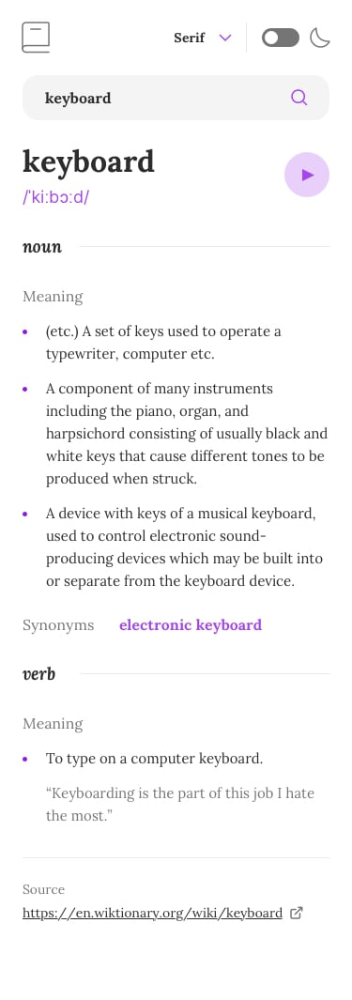

# DefineSphere dictionary

API:
[DictionaryAPI](https://api.dictionaryapi.dev/api/v2/entries/en/keyboard)

### Tools
- React
- Tailwind
- Typescript 

### Users should be able to:

- Search for words using the input field
- See the Free Dictionary API's response for the searched word
- See a form validation message when trying to submit a blank form
- Play the audio file for a word when it's available
- Switch between serif, sans serif, and monospace fonts
- Switch between light and dark themes
- View the optimal layout for the interface depending on their device's screen size
- See hover and focus states for all interactive elements on the page

- I think it will take me 3 hours to finish this page

## images:

